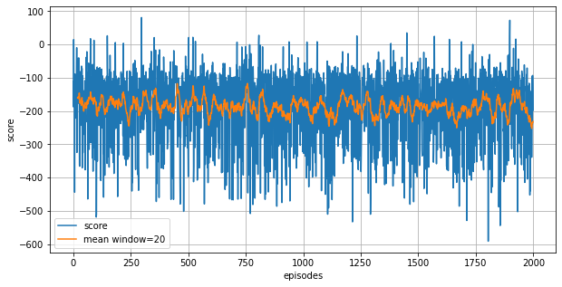

# Lunar Lander
Project for solving the OpenAI Gym LunarLander-v2 environment using DDQN.

## Introduction

Landing pad is always at coordinates (0,0). Coordinates are the first two numbers in state vector. Reward for moving from the top of the screen to landing pad and zero speed is about 100..140 points. If lander moves away from landing pad it loses reward back. Episode finishes if the lander crashes or comes to rest, receiving additional -100 or +100 points. Each leg ground contact is +10. Firing main engine is -0.3 points each frame. Solved is 200 points. Landing outside landing pad is possible. Fuel is infinite, so an agent can learn to fly and then land on its first attempt. Four discrete actions available: do nothing, fire left orientation engine, fire main engine, fire right orientation engine.

## Installation

Use the [docker](https://www.docker.com) to test the algorithm.

```bash
docker pull fernandofsilva/lunarlander
```


## Usage

Run with default parameters

```bash
docker run fernandofsilva/lunarlander
```

Run with custom parameters

```bash
docker run fernandofsilva/lunarlander --n_episodes 2000 --max_t 1000 --eps_start 1.0 --eps_end 0.01 --eps_decay 0.995 --buffer_size 100000 --batch_size 64 --gamma 0.99 --tau 0.001 --lr 0.0005 --update_every 4 
```

Each parameter correspond to:

- n_episodes: maximum number of training episodes
- max_t: maximum number of time-steps per episode
- eps_start: starting value of epsilon, for epsilon-greedy action selection
- eps_end: minimum value of epsilon
- eps_decay: multiplicative factor (per episode) for decreasing epsilon
- buffer_size: replay buffer size
- batch_size: mini-batch size
- gamma: discount rate
- tau: a soft update of target parameters
- lr: learning rate
- update_ever: how often to update the network


## Output

Expected final output

```
Episode 200      Average Score: -197.81
```


## Scores

Below, there are the scores during training of the neural network




## Contributing
Pull requests are welcome. For major changes, please open an issue first to discuss what you would like to change.


## License
[MIT](https://choosealicense.com/licenses/mit/)